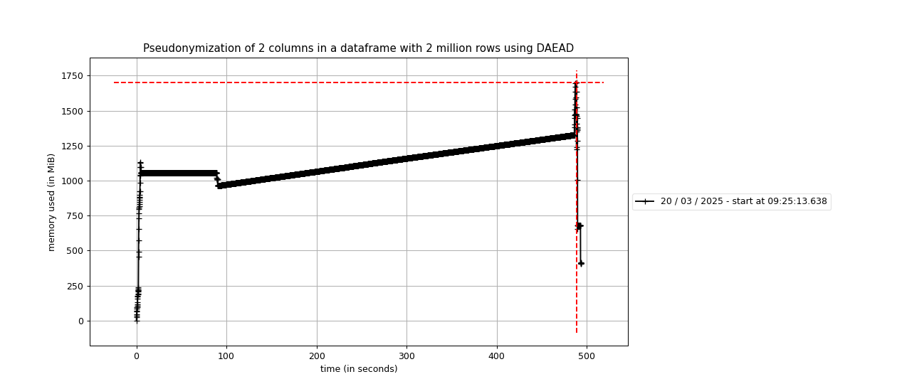

# Dapla Lab kladdeark

Profiling results from 'delomaten'. Pseudonymizing two columns
using DAEAD.

| Rows         | Max memory usage | Real time  | User time |   |
|--------------|------------------|------------|-----------|---|
| 1 million    | ~1GB             | 3m31s      |           |   |
| 1.5 million  | ~1.1GiB          | 4m43s      |           |   |
| 2 million    | ~1.7GiB          | 8m14s      | 4m23s     |   |

Different profiling results:
