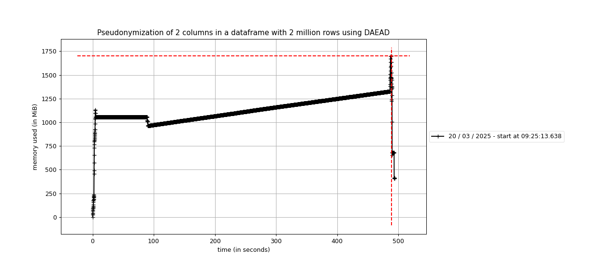
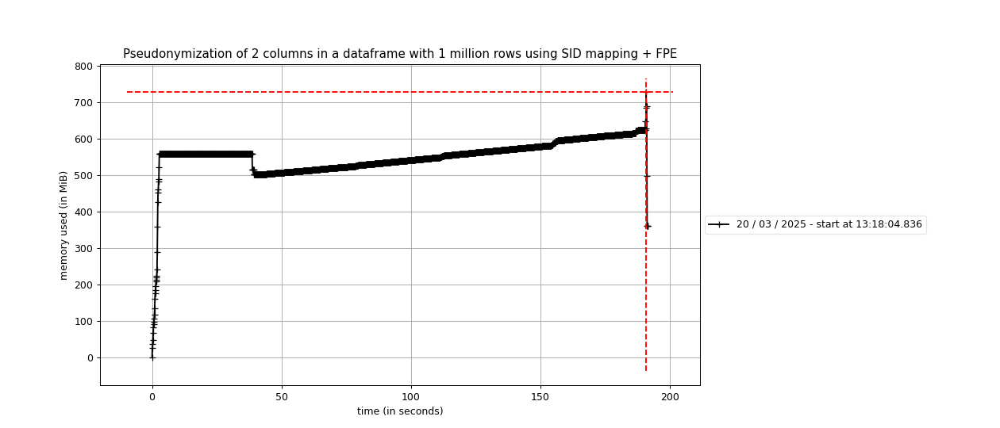
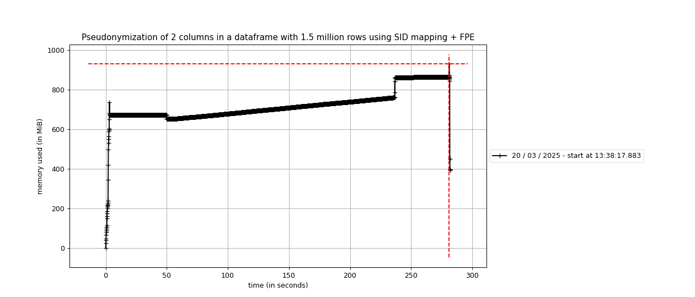
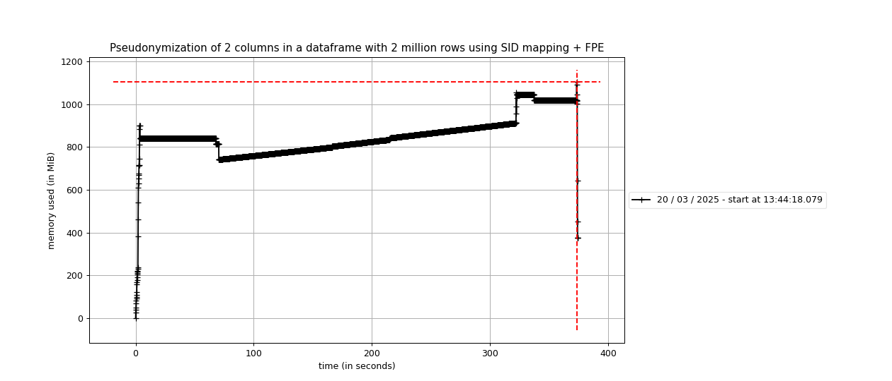
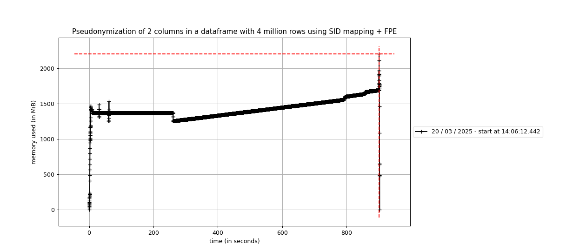

# Dapla Lab kladdeark

## Profiling pseudonymization
Profiling pseudonymization through dapla-toolbelt-pseudo.
Tests are run using the command `time uv run mprof run main.py write <ARGS>`.

TODO: Run the tests several times and normalize the results.

### DAEAD
Profiling pseudonymizing two columns using DAEAD.
The dataset here is randomly generated ascii strings of length 20.

| Rows         | Max memory usage | Real time  | User time | Profiling result                                      |
|--------------|------------------|------------|-----------|-------------------------------------------------------|
| 1 million    | ~1GB             | 3m31s      |           |                                                       |
| 1.5 million  | ~1.1GiB          | 4m43s      |           |                                                       |
| 2 million    | ~1.7GiB          | 8m14s      | 4m23s     | |

### SID mapping + FPE (format preserving)
Profiling pseudonymizing two columns using SID mapping + FPE.
The dataset here is 3 test 'fnr's that are repeated to form a column of `n` rows.

| Rows         | Max memory usage | Real time  | User time | Profiling result                                    |
|--------------|------------------|------------|-----------|-----------------------------------------------------|
| 1 million    | ~0.73GiB         | 3m12s      | 1m43s     |   |
| 1.5 million  | ~0.78GiB         | 4m42       | 2m23s     | |
| 2 million    | ~1.1GiB          | 6m14s      | 3m10s     |   |
| 3 million    | ~1.6GiB          | 8m53s      | 4m27s     |   |
| 4 million    | ~2.25GiB         | 15m4s      | 7m2s      |   |