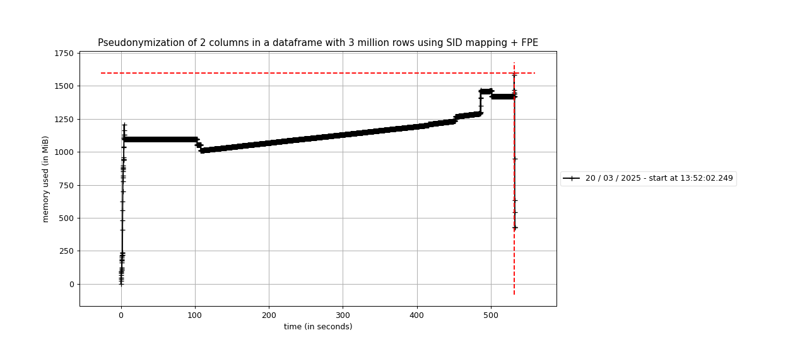

# Dapla Lab kladdeark

## Profiling pseudonymization
Profiling pseudonymization through dapla-toolbelt-pseudo.
Tests are run using the command `time uv run mprof run main.py write <ARGS>`.

### DAEAD
Profiling pseudonymizing two columns using DAEAD.
The dataset here is randomly generated ascii strings of length 20.

| Rows         | Peak memory usage | Real time  | User time | Profiling result                                      |
|--------------|------------------|-------------|-----------|-------------------------------------------------------|
| 1 million    | ~1GB             | 3m31s       |           |                                                       |
| 1.5 million  | ~1.1GiB          | 4m43s       |           |                                                       |
| 2 million    | ~1.7GiB          | 8m14s       | 4m23s     | |

### SID mapping + FPE (format preserving)

#### One column
Profiling pseudonymizing one column using SID mapping + FPE.
The dataset used here is 3 test 'fnr's that are repeated to form a column of `n` rows.

| Rows       | Peak memory usage | Real time  | User time | Profiling result                                     |
|------------|-------------------|------------|-----------|------------------------------------------------------|
| 1 million  | ~0.52GiB          | 3m7s       | 1m3s      | |
| 2 million  | ~0.78GiB          | 5m53s      | 2m2s      | |
| 3 million  | ~1.1GiB           | 7m58s      | 3m20s     | |
| 3 million  | ~1.05GiB          | 8m53s      | 3m15s     | |
| 3 million  | ~1.025GiB         | 8m6s       | 3m7s      | |
| 3 million  | ~1.06GiB          | ~8m19s (avg)| ~3m10s (avg)| Result averaged over 3 runs                         |
| 4 million  | ~1.35GiB          | 10m55s     | 4m11s     |  |
| 4 million  | ~1.3GiB           | 11m1s     | 4m7s      |  |
| 4 million  | ~1.38GiB          | 12m6s     | 4m33s     |  |
| 4 million  | ~1.34GiB         | ~11m21s (avg)|  ~4m17s(avg)| Result averaged over 3 runs                         |

#### Two columns
Profiling pseudonymizing two columns using SID mapping + FPE.
The dataset used here is 3 test 'fnr's that are repeated to form a column of `n` rows.

| Rows        | Peak memory usage | Real time  | User time | Profiling result                                    |
|-------------|-------------------|------------|-----------|-----------------------------------------------------|
| 1 million   | ~0.73GiB          | 3m12s      | 1m43s     |   |
| 1.5 million | ~0.78GiB          | 4m42       | 2m23s     | |
| 2 million   | ~1.1GiB           | 6m14s      | 3m10s     |   |
| 3 million   | ~1.6GiB           | 8m53s      | 4m27s     |   |
| 4 million   | ~2.25GiB          | 15m4s      | 7m2s      |   |